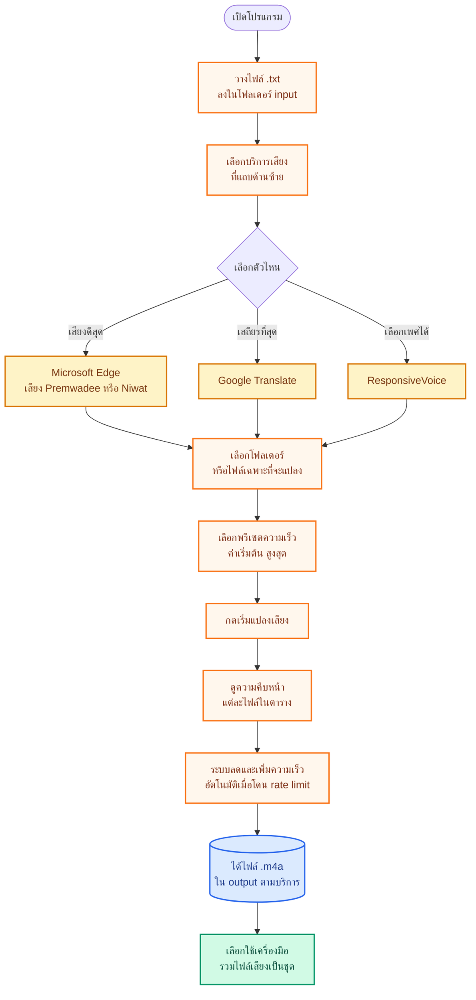

# INKTTS

โปรแกรมแปลงไฟล์ข้อความเป็นเสียงทีละหลายไฟล์ — ใช้บริการเสียงฟรี ไม่ต้องสมัครสมาชิก ไม่ต้องใส่ API key

วางไฟล์ `.txt` หลายไฟล์ → เลือกบริการเสียง → กดเริ่ม → ได้ไฟล์ `.m4a` ฟังได้เลย

---

## สารบัญ

1. [เริ่มต้นใช้งาน](#เริ่มต้นใช้งาน)
2. [โฟลเดอร์ต่าง ๆ — วางไฟล์อะไรที่ไหน](#โฟลเดอร์ต่าง-ๆ--วางไฟล์อะไรที่ไหน)
3. [ขั้นตอนภาพรวม](#ขั้นตอนภาพรวม)
4. [3 บริการเสียง — เลือกใช้ตัวไหนดี](#3-บริการเสียง--เลือกใช้ตัวไหนดี)
5. [หน้าหลัก — แปลงเสียง](#หน้าหลัก--แปลงเสียง)
6. [เครื่องมือ — รวมไฟล์เสียง](#เครื่องมือ--รวมไฟล์เสียง)
7. [หน้าตั้งค่า](#หน้าตั้งค่า)
8. [พรีเซตและการปรับขั้นสูง](#พรีเซตและการปรับขั้นสูง)
9. [แก้ปัญหาที่พบบ่อย](#แก้ปัญหาที่พบบ่อย)

---

## เริ่มต้นใช้งาน

### บนเครื่อง Windows

1. ดาวน์โหลด **`INKTTS-Portable-x.x.x.exe`** จาก [หน้าดาวน์โหลด](https://github.com/snibzyz/inktts/releases/latest)
2. วางที่ไหนก็ได้ — ไม่ต้องติดตั้ง เป็นไฟล์เดียวจบ
3. ดับเบิลคลิกเปิด
4. ถ้ามีแถบเตือนของ Windows → กด **More info** → **Run anyway**

### บนเครื่อง Mac

| ไฟล์ที่โหลด | เหมาะกับ |
|---|---|
| **`INKTTS-x.x.x-arm64.dmg`** | Mac ชิป M1/M2/M3/M4 (Apple Silicon) |
| **`INKTTS-x.x.x-x64.dmg`** | Mac ชิป Intel |

> ⚠ **โหลดให้ตรงชิป** — ใช้ผิดชิป ffmpeg จะรันไม่ได้ → รวมเสียงไม่ออก
> เช็คชิป: เมนู Apple () → About This Mac → ดูบรรทัด Chip/Processor

1. ดาวน์โหลด `.dmg` → ดับเบิลคลิก → ลาก INKTTS ไปยัง Applications
2. **เปิดครั้งแรก** — เลือกตามอาการ:

##### กรณี A: ขึ้น "ไม่สามารถตรวจสอบผู้พัฒนา" (มีปุ่ม Open)
- คลิกขวาที่ INKTTS → **Open** → **Open** อีกครั้ง

##### กรณี B: ขึ้น "**INKTTS เสียหายและเปิดไม่ได้**" / "is damaged" (ไม่มีปุ่ม Open) — เจอบ่อยบน M1/M2/M3/M4
- เปิด **Terminal** (⌘+Space พิมพ์ "terminal")
- รัน:
  ```bash
  xattr -cr /Applications/INKTTS.app
  ```
- เปิด INKTTS ใหม่ — จะใช้ได้ปกติ

> **ทำไมต้องทำ?** INKTTS ยังไม่ได้ Apple Developer cert — macOS จะติด quarantine flag ตอนโหลด
> คำสั่ง `xattr -cr` ลบ flag (ทำครั้งเดียว · ปลอดภัย · ไม่ต้องเป็น admin)

> **ทำไม "รวมเสียงไม่ออก" บน Mac แม้ติดตั้งได้?**
> - ส่วนใหญ่เกิดจากดาวน์โหลด `.dmg` ผิดชิป (เช่นโหลด arm64 ไปลงบน Intel Mac) → ffmpeg ในแอปรันไม่ได้
> - แอปฝัง ffmpeg ของชิปนั้น ๆ เข้ามาแล้วตามไฟล์ — ไม่ต้องลง ffmpeg แยก
> - ถ้ายังรวมไม่ได้ → เปิด Settings → ดู log → ส่งให้ผู้พัฒนา

### อัปเดตอัตโนมัติ

- **Windows (portable)**: ตรวจอัปเดตทุก 30 นาที — เมื่อมีเวอร์ชันใหม่จะมีแถบแจ้งด้านบน กดอัปเดตได้ทันที
- **Mac**: แจ้งเตือนเมื่อมีเวอร์ชันใหม่ — คลิก "ดาวน์โหลด" เพื่อโหลด `.dmg` ใหม่

---

## โฟลเดอร์ต่าง ๆ — วางไฟล์อะไรที่ไหน

ตอนติดตั้ง INKTTS จะใช้ 2 โฟลเดอร์ — เปลี่ยนได้ที่หน้า "ตั้งค่า"

### โฟลเดอร์ที่ "คุณ" วางไฟล์

| โฟลเดอร์ | วางไฟล์อะไร |
|---|---|
| **`input/`** | ไฟล์ข้อความ `.txt` ที่จะแปลงเป็นเสียง (จะกี่ไฟล์ก็ได้) |

### โฟลเดอร์ที่ "ระบบ" สร้างให้

| โฟลเดอร์ | ระบบใส่อะไรให้ |
|---|---|
| **`output/<บริการ>/`** | ไฟล์เสียง `.m4a` ผลลัพธ์ — แยกตามบริการที่ใช้ (เช่น `output/edge/`, `output/google/`) |
| **`_cache/`** | ไฟล์เสียงชิ้นย่อยระหว่างทำงาน — ไม่ต้องแตะ ลบทิ้งได้ |

### ตำแหน่งโฟลเดอร์ในเครื่อง

- **รุ่น Portable (Windows)**: ข้างไฟล์ `.exe`
- **รุ่นติดตั้ง / Mac**: โฟลเดอร์ของผู้ใช้ (เปลี่ยนได้ที่ "ตั้งค่า")

> เปลี่ยนได้ทั้งสองโฟลเดอร์ในหน้า "ตั้งค่า" — INKTTS จะจำเลือกไว้ครั้งต่อไป

---

## ขั้นตอนภาพรวม

ขั้นตอนการใช้งาน จากเปิดแอปจนได้ไฟล์เสียง



> สีส้ม = คุณทำเอง · สีเหลือง = เลือกบริการ · สีฟ้า = ไฟล์ที่ได้ · สีเขียว = เครื่องมือเสริม

---

## 3 บริการเสียง — เลือกใช้ตัวไหนดี

INKTTS มี 3 บริการเสียงฟรีให้เลือก สลับกันได้ตามต้องการ

| บริการ | คุณภาพเสียง | ความเสถียร | ใช้เมื่อ |
|---|:---:|:---:|---|
| **Microsoft Edge** | ดีเยี่ยม | กลาง | อยากได้เสียงธรรมชาติที่สุด (แนะนำเริ่มจากตัวนี้) |
| **Google Translate** | ปานกลาง | สูงที่สุด | แปลงไฟล์เยอะ ๆ ติดต่อกัน · กลัวพลาด |
| **ResponsiveVoice** | ปานกลาง | กลาง | อยากเลือกเพศชาย/หญิงได้ |

### Microsoft Edge — เสียง Premwadee Neural

- เสียง 2 แบบ:
  - **Premwadee** (เสียงหญิง)
  - **Niwat** (เสียงชาย)
- ตั้งความเร็วเสียงด้วยข้อความ เช่น `+30%` (เร็วขึ้น 30%), `-20%` (ช้าลง), `+0%` (ปกติ)
- รับข้อความยาวได้ ไม่จำเป็นต้องตัดเอง

### Google Translate — เสถียรที่สุด

- เสียงไทยมาตรฐาน
- ตั้งความเร็วด้วยตัวเลื่อน (0.5 = ช้าครึ่งหนึ่ง, 1.3 = ปกติเร็วขึ้นนิด, 2.0 = เร็วสองเท่า)
- ตัดข้อความเป็นชิ้นเล็ก ๆ ส่งทีละชิ้น — ทนต่อ rate limit

### ResponsiveVoice — เลือกเพศได้

- เลือกได้ทั้งเสียงชาย/หญิง
- ตั้งความเร็วได้ 2 ระดับ: "ความเร็วเสียง" (ตอนเล่น) และ "ความเร็วของ API" (ตอนสร้าง)

> ไม่แน่ใจเลือกอะไร เริ่มที่ **Microsoft Edge** ก่อน — ถ้าโดน rate limit ค่อยสลับไป Google

---

## หน้าหลัก — แปลงเสียง

แต่ละบริการมีหน้าจอเดียวกัน แบ่งเป็น 3 ส่วนหลัก

### ส่วน 1 — "ไฟล์ที่จะแปลง"

มีปุ่ม 2 แบบ:
- **เลือกโฟลเดอร์** — ใช้ไฟล์ `.txt` ทุกอันในโฟลเดอร์ที่เลือก
- **เลือกไฟล์ (เลือกได้หลาย)** — เลือกเฉพาะไฟล์ที่ต้องการ

ตัวเลือกเสริม:
- **แปลงทุกไฟล์** (ค่าเริ่มต้น) — ใช้ทุกไฟล์ที่เจอ
- **หรือเลือกแค่ N ไฟล์แรก** — ทดสอบกับ 2-3 ไฟล์ก่อนแปลงจริง

ระบบจะบอกข้างล่างว่ามีไฟล์กี่อัน เช่น `พบ 50 ไฟล์ใน input/`

### ส่วน 2 — "ตั้งค่าการแปลง"

- **พรีเซต** (สูงสุด / สูง / กลาง / น้อย / ไฟล์เดียว / ช้าแต่ปลอดภัย) — เริ่มที่ "สูงสุด" → ถ้าโดน rate limit ค่อยลด
- **เลือกเสียง** (Edge: Premwadee/Niwat · RV: หญิง/ชาย)
- **ความเร็วเสียง**
- ขยายดูได้ที่ **"ตั้งค่าขั้นสูง"** — ปรับจำนวนไฟล์ต่อรอบ / connection ต่อไฟล์ / อื่น ๆ

### ส่วน 3 — ปุ่มควบคุม + ความคืบหน้า

| ปุ่ม | ทำอะไร |
|---|---|
| **เริ่มแปลงเสียง** | เริ่มงาน |
| **หยุด** | ขอหยุด (รอไฟล์ที่กำลังทำให้เสร็จก่อน) |
| **ลองใหม่เฉพาะที่ล้มเหลว (N)** | กลับมาทำใหม่เฉพาะไฟล์ที่ fail |
| **เปิดโฟลเดอร์ผลลัพธ์** | เปิดโฟลเดอร์ `output/<บริการ>/` ในตัวจัดการไฟล์ |

ใต้ปุ่มมีตารางความคืบหน้า — บอกแต่ละไฟล์ว่าอยู่สถานะอะไร:

| สถานะ | ความหมาย |
|---|---|
| **รอคิว** | ยังไม่ถึงคิว |
| **เสร็จ** | แปลงสำเร็จ มีไฟล์ `.m4a` แล้ว |
| **ล้มเหลว** | สร้างเสียงไม่ผ่าน (เน็ตขัด/rate limit) — ลองใหม่ได้ |
| **รวมเสียงพลาด** | สร้างชิ้นย่อยได้ แต่รวมเป็น `.m4a` ไม่สำเร็จ |
| **ข้าม** | มีไฟล์อยู่แล้วไม่ทำซ้ำ |
| **ว่าง** | ไฟล์ต้นฉบับไม่มีเนื้อหา |

สรุปด้านล่าง: `ทั้งหมด N · สำเร็จ X · ล้มเหลว Y · รอ Z · ข้าม K`

### ระบบ "ลด/เพิ่มความเร็วอัตโนมัติ"

ระหว่างแปลง ถ้าโดนเซิร์ฟเวอร์ปฏิเสธ INKTTS จะ:
- **ลดความเร็วลงเอง** — ทำพร้อมกันน้อยลง ป้องกันโดนแบน
- **เพิ่มกลับเองเมื่อสถานการณ์ดีขึ้น** — ไม่ต้องปรับเอง

จะเห็นข้อความเช่น `ลดความเร็วอัตโนมัติ: 20/50` — แปลว่าเดิม 50 ไฟล์พร้อมกัน ตอนนี้เหลือ 20

---

## เครื่องมือ — รวมไฟล์เสียง

ในแถบซ้าย คลิก **"รวมไฟล์เสียง"** — สำหรับรวมไฟล์ตอนสั้น ๆ เป็นไฟล์ใหญ่

**ใช้ทำอะไร**: มีตอน 1–600 ทำเสียงครบแล้ว → อยากรวมเป็นชุดละ 10 ตอน (1–10, 11–20, ...) เพื่อฟังเป็นชุดยาว

### ขั้นตอน

1. **โฟลเดอร์ต้นทาง** — กดเลือก → โฟลเดอร์ที่มีไฟล์ `.m4a`
2. **คำนำหน้าชื่อไฟล์** — กรอกชื่อนิยาย เช่น `ติดหนี้สามสิบล้าน ` (เว้นวรรคก่อนเลขตอน)
3. **ตั้งแต่ตอน — ถึงตอน** — เช่น 401 ถึง 600
4. **จัดกลุ่มละ (ตอน)** — เช่น 10 = รวม 10 ตอนต่อ 1 ไฟล์
5. **นามสกุล** — m4a (ค่าเริ่มต้น)
6. ระบบจะตรวจหาไฟล์ + แสดงตัวอย่างชื่อไฟล์ที่จะได้
7. กด **"เริ่มรวม"** → ได้ไฟล์ในโฟลเดอร์ `<ต้นทาง>_merged`

### ตัวอย่าง

ต้นทาง: `ติดหนี้สามสิบล้าน 401.m4a`, `... 402.m4a`, ... `... 600.m4a` (รวม 200 ไฟล์)

ผลลัพธ์ใน `<ต้นทาง>_merged`:
- `ติดหนี้สามสิบล้าน 401-410.m4a` (10 ตอน)
- `ติดหนี้สามสิบล้าน 411-420.m4a`
- `...`
- `ติดหนี้สามสิบล้าน 591-600.m4a`

รวม 20 ไฟล์

---

## หน้าตั้งค่า

ในแถบซ้าย คลิก **"ตั้งค่า"**

### กลุ่ม "โฟลเดอร์ทำงาน"

| ตัวเลือก | ทำอะไร |
|---|---|
| **ไฟล์ข้อความต้นฉบับ (.txt)** | ตั้งโฟลเดอร์ที่จะอ่านไฟล์ต้นฉบับจาก (ค่าเริ่มต้น `input/` ข้างแอป) |
| **ไฟล์เสียงผลลัพธ์ (.m4a)** | ตั้งโฟลเดอร์ที่จะบันทึกไฟล์เสียง (ค่าเริ่มต้น `output/`) |
| **โฟลเดอร์โปรแกรม** | ดูที่อยู่ของไฟล์ `.exe` |
| **โฟลเดอร์ตั้งค่า** | ดูที่อยู่ที่เก็บการตั้งค่า |

ปุ่มข้าง ๆ:
- **เลือก** — กดเปลี่ยนโฟลเดอร์
- **ไอคอนโฟลเดอร์** — เปิดในตัวจัดการไฟล์
- **รีเซ็ตเป็นค่าเริ่มต้น** — กลับเป็นค่าเริ่มต้นของแอป

### กลุ่ม "เวอร์ชัน + อัปเดต"

- ดูเวอร์ชันปัจจุบัน
- ปุ่ม **"ตรวจหาอัปเดต"** — เช็คเวอร์ชันใหม่บน GitHub
- ผลตรวจ:
  - **"พบเวอร์ชันใหม่"** — แถบสีเขียว
  - **"เป็นเวอร์ชันล่าสุดแล้ว"** — แถบสีเทา
  - **"ตรวจไม่ได้"** — แถบสีเหลือง (ใช้ได้เฉพาะรุ่น Portable บน Windows)

### กลุ่ม "เกี่ยวกับ"

ข้อมูลแอป + เครดิตผู้พัฒนา

---

## พรีเซตและการปรับขั้นสูง

INKTTS มี **พรีเซต** สำเร็จรูป — ไม่ต้องเข้าใจรายละเอียดก็ใช้งานได้ทันที

### พรีเซตของ Microsoft Edge

| พรีเซต | ทำพร้อมกัน | ใช้เมื่อ |
|---|:---:|---|
| **สูงสุด — เร็วที่สุด** | 50 ไฟล์ | ค่าเริ่มต้น เร็วที่สุด · เน็ตเร็ว |
| **สูง** | 20 ไฟล์ | ปลอดภัยขึ้นนิด |
| **กลาง** | 10 ไฟล์ | สมดุล |
| **น้อย** | 5 ไฟล์ | ปลอดภัย |
| **ไฟล์เดียว — เร็วต่อไฟล์** | 1 ไฟล์ | อยากให้ 1 ไฟล์เสร็จเร็ว ไม่สนรวม |
| **ช้าแต่ปลอดภัย** | 4 ไฟล์ | กันถูกจำกัดเรท · ใช้เมื่อโดน fail บ่อย |

### พรีเซตของ Google / ResponsiveVoice

ปริมาณน้อยกว่า Edge (เพราะ rate limit เข้มกว่า) — ใช้พรีเซตสำเร็จรูปได้เลย

### ตั้งค่าขั้นสูง (ไม่จำเป็นต้องแตะ)

กดที่ **"ตั้งค่าขั้นสูง (สำหรับผู้ใช้ที่ต้องการปรับ)"** จะเห็น:

- **จำนวนไฟล์ต่อรอบ** — กี่ไฟล์ที่ทำพร้อมกัน
- **การเชื่อมต่อต่อไฟล์** — กี่ chunk ของไฟล์เดียวกันที่ส่งพร้อมกัน
- **ตัวอักษรต่อส่วน** — ตัดข้อความเป็นชิ้นย่อยกี่ตัวอักษร (Google/RV)
- **หน่วงสุ่ม** — เว้นช่วงสุ่มระหว่างคำขอ (Google: กันถูกจำกัดเรท)
- **จำนวนบรรทัดต่อส่วนเสียง** — Edge

ระบบบอกใต้ช่อง: `การเชื่อมต่อรวม: N × M = X (เพดาน Y)` — ถ้าเกินเพดานจะเตือน

---

## แก้ปัญหาที่พบบ่อย

| ปัญหา | วิธีแก้ |
|---|---|
| Windows ขึ้นแถบเตือนสีน้ำเงิน | กด **More info** → **Run anyway** |
| Mac เปิดไม่ได้ "ไม่รู้จักผู้พัฒนา" | คลิกขวาที่ไอคอน → **Open** → **Open** (อย่าดับเบิลคลิก) |
| **แปลงแล้วได้ไฟล์ 0 KB / ฟังไม่ได้** | บริการนั้นโดน rate limit ชั่วคราว — กดปุ่ม **"ลองใหม่เฉพาะที่ล้มเหลว"** หรือเปลี่ยนเป็น **Google** (เสถียรที่สุด) หรือสลับพรีเซตเป็น **"ช้าแต่ปลอดภัย"** |
| **เสียงเร็ว/ช้าเกินไป** | ปรับ "ความเร็วเสียง": Edge ใส่ `+30%` หรือ `-20%` · Google/RV เลื่อนแถบ |
| **ข้อความยาวมาก แปลงได้ไหม** | ได้ — โปรแกรมตัดเป็นชิ้นย่อยอัตโนมัติ ไม่มีจำกัดความยาว |
| **เปลี่ยนโฟลเดอร์ input/output ได้ไหม** | ได้ — หน้า **ตั้งค่า → โฟลเดอร์ทำงาน** เลือกใหม่ จะจำไว้ครั้งหน้า |
| **อยากรวมไฟล์เสียงเป็นชุด** | ใช้เครื่องมือ **"รวมไฟล์เสียง"** ทางซ้าย |
| **แปลงไม่เริ่ม / "ไม่มีไฟล์ให้แปลง"** | ตรวจว่ามี `.txt` ในโฟลเดอร์ที่เลือก · ถ้าใส่ใน input/ ของ Portable ตรวจว่าวางในโฟลเดอร์เดียวกับ `.exe` |
| **เริ่มแล้วช้าลงเรื่อย ๆ** | ปกติ — ระบบลดความเร็วเองเมื่อโดน rate limit — ปล่อยไว้ มันจะเพิ่มกลับเมื่อสถานการณ์ดีขึ้น |
| **อยากแปลงเฉพาะ 2-3 ไฟล์ก่อนทดสอบ** | ติ๊ก **"หรือเลือกแค่ N ไฟล์แรก"** ใส่ 2 หรือ 3 |
| **ลองใหม่แล้วยังพลาด** | สลับบริการ → Google เสถียรที่สุด · หรือพักไว้สัก 10-30 นาที แล้วลองใหม่ |
| **ไฟล์ตอนแรกซ้ำกับเลขในชื่อ** | ในเครื่องมือ "รวมไฟล์เสียง" ใส่ **คำนำหน้า** ให้ตรงและเว้นวรรคก่อนเลข |

---

## ข้อกำหนดเครื่อง

- Windows 10/11 หรือ macOS (ทั้งชิป M1/M2/M3/M4 และ Intel)
- ต้องต่ออินเทอร์เน็ตตลอดระหว่างแปลงเสียง (บริการ TTS เป็นออนไลน์)
- ไม่ต้องลง Python, ffmpeg หรือโปรแกรมเสริมใด ๆ — ฝังมาในแอปครบแล้ว

---

## สำหรับนักพัฒนา

INKTTS เป็น **Electron + React + TypeScript + Vite + Tailwind** ในตระกูล INKIDEA / INKCRAW / INKWRIGHT

```bash
pnpm install                 # ติดตั้ง dependency
pnpm dev                     # โหมดพัฒนา (Vite + Electron hot-reload)
pnpm package:win             # build Windows portable .exe
pnpm package:mac             # build macOS .dmg (ต้องรันบน Mac)
pnpm release 2.1.0           # bump version + tag + push → trigger CI build
pnpm smoke:tts edge          # smoke test เครื่องเดียว: edge | google | rv
pnpm smoke:merge             # smoke test เครื่องมือรวมไฟล์
```

ต้องมี Node.js 20+, pnpm 9+ · รายละเอียดสถาปัตยกรรมที่ [`.claude/CLAUDE.md`](.claude/CLAUDE.md)

---

## ลิขสิทธิ์

MIT — ใช้ได้เสรี
